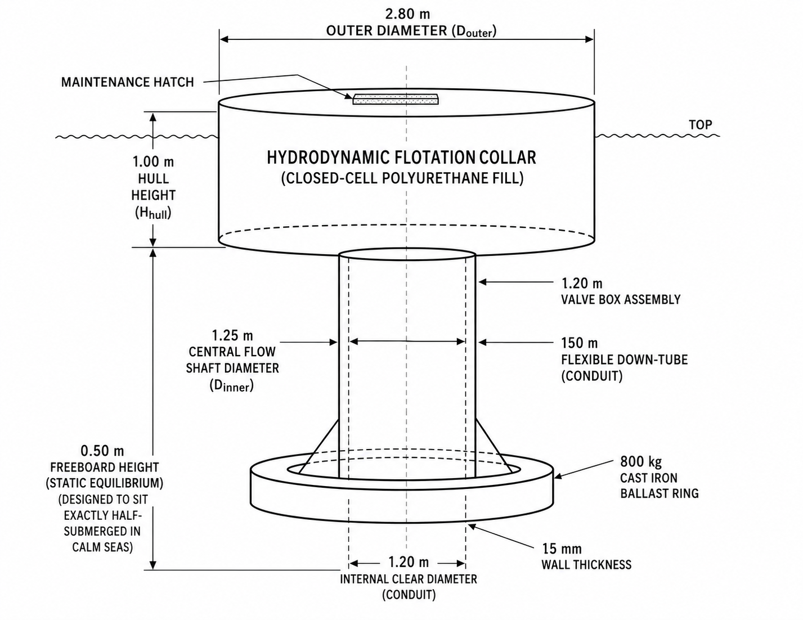
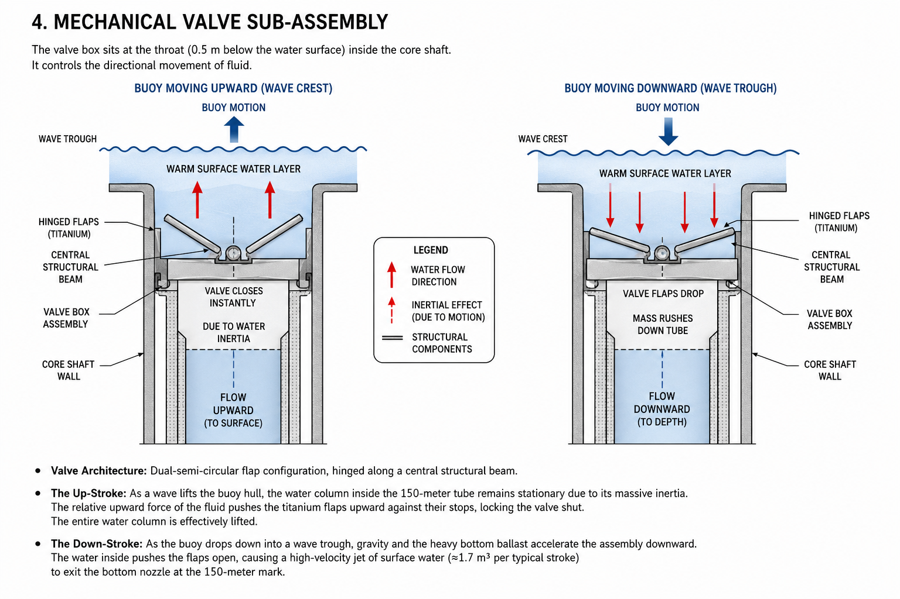
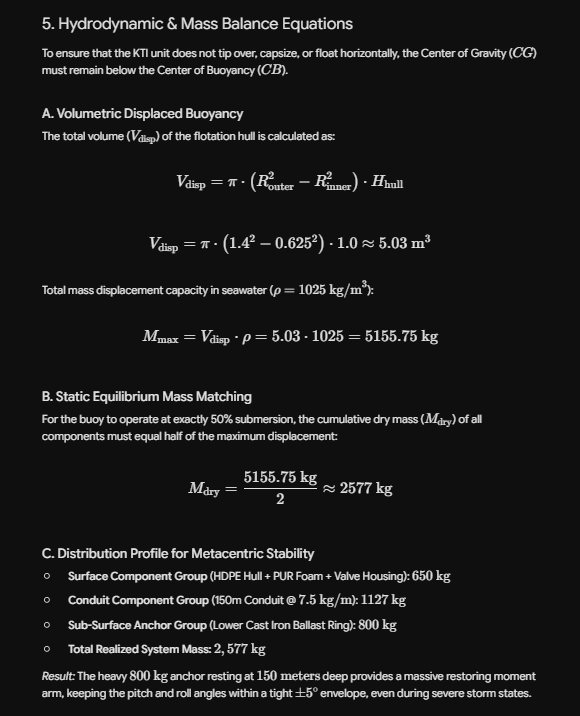

# ENGINEERING DESIGN SPECIFICATION: KINETIC THERMOCLINE INVERTER (KTI)

## 1. System Overview & Operation Principle
The Kinetic Thermocline Inverter (KTI) is a decentralized, zero-input mechanical pumping system deployed to selectively alter localized ocean thermal profiles. It leverages ocean surface wave energy to continuously displace warm surface water into deeper layers.

## 2. Structural & Mechanical Blueprint

### Surface Floating Hull
- Outer Diameter: **2.80 m**
- Central Flow Shaft Diameter: **1.25 m**
- Hull Height: **1.00 m**
- Freeboard Height: **0.50 m**

### Downward Displacement Tube
- Internal Clear Diameter: **1.20 m**
- Wall Thickness: **15 mm**
- Length: **150 m**

## 3. Material Specifications
- HDPE Hull
- Polyurethane Foam Matrix
- EPDM Flexible Conduit
- Titanium Flap Valve
- Cast Iron Ballast Ring

## 4. Mechanical Valve Sub-Assembly

- Dual semi-circular flap design
- Up-stroke closes valve due to inertia
- Down-stroke opens valve and pushes flow downward

## 5. Hydrodynamic & Mass Balance Equations

- Maximum displacement: **5155.75 kg**
- Dry mass target: **2577 kg**

## 6. Deployment Logistics
- Swarm matrix deployment
- Three-point tension-leg mooring
- Silicone antifouling coating
